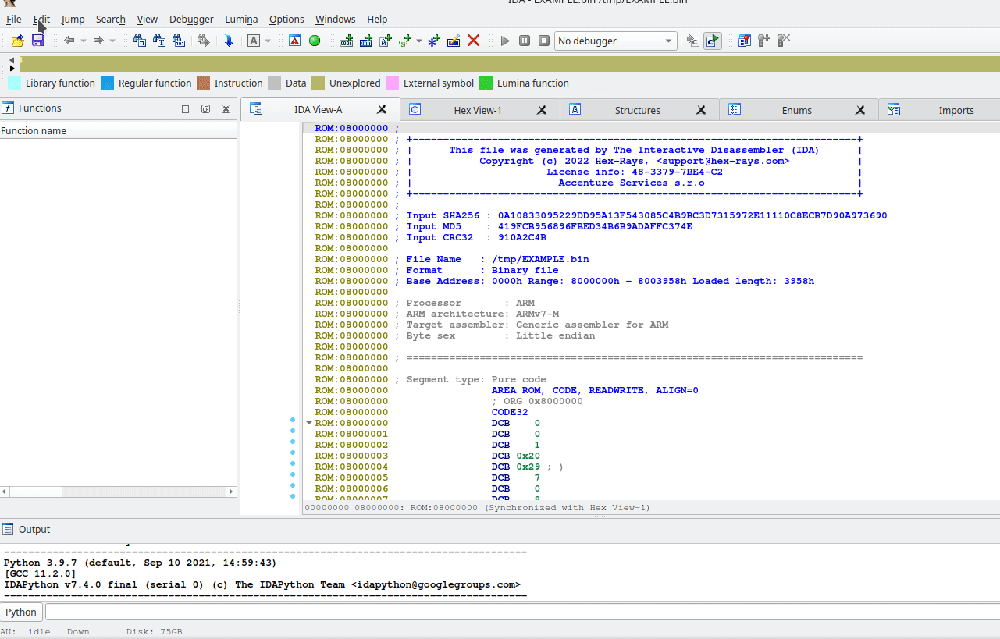
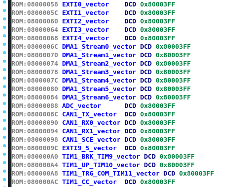

# FirmLoader

The FirmLoader is an IDA plugin that allows to automatically identify parts of the memory for the firmware images extracted from microcontrollers. This simplifies the process of understanding the binary contents and thus allows you to achieve your reversing goals more efficiently. The plugin is similar to the built-in SVD loader; however, it offers a simpler data structure that could be created manually from the publicly available documentation.

## Installation

Copy the `firmloader.py` and `firmloader_data` folder to the IDA plugin folder (for example: `cp -R fimrloader* <IDA_FOLDER>/plugins`).

## Usage

Load the binary into IDA, make sure that the base address is in accordance with the documentation for the given processor, set the name of the main code segment to `ROM` and then use `Edit` > `FirmLoader` menu to select the MCU model. Note that this will trigger the auto-analysis of the binary. 



## Features

The main motivation for creating this plugin was to make it possible to create simple JSON structures from documentation to supplement the SVD files and add couple more features:

**Add basic RAM automatically**

With FirmLoader plugin you do not have to create RAM section as it will create it for you automatically (including the RAM sections that are split across multiple locations). Note that when the series of MCU offers several sizes of memory all units from that series were generated with the highest portion of RAM space.

**Interrupt Vector Table**

Another enhancement over the SVD loader features allows FirmLoader to set the interrupt vector table (where applicable) and mark the items as pointers to the code section to allow easy inspection of various event handlers right away.



**Manually create description files**

In case that the MCU is of a different architecture, the structure of the metadata used by this plugin is much simpler than SVD files and thus can be easily created from the documentation manually. Doing this will avoid the lengthy process of identifying peripherals, segments, and interrupt handlers when the same model of MCU is encountered again in the future. In case that some of the information is not available or is not applicable for the given target just leave the irrelevant sections of the [data_template.json](./data_template.json) empty (do not delete them). Example of a purely manually created data file is the [SPC50B64x](./firmloader_data/SPC560B64x.json).

Template for the data file:
```json
{   // All numbers in the file except the "bits" field use hexadecimal format to make it easier to copy paste from the documentation
    "brand": "MANUFACTURER", // Manufacturer of the MCU (used for menu items)
    "family": "SERIES", // Series (used for menu items)
    "name": "NAME", // Name of the MCU (used for menu items)
    "bits": 32, // Address size of the MCU in bits
    "mode": 1,  // Mode of operation (ARM only at this point) 0 - ARM, 1 - Thumb
    "segments": [
        {
            "name": "DATA_FLASH", // Name of the segment
            "start": "0x0", // Base address
            "end": "0x7ffff",   // End address
            "type": "DATA"  // Type of the segment (either CODE or DATA)
        },
        {
            "name": "SRAM",
            "start": "0x20000000",
            "end": "0x200fffff",
            "type": "DATA"
        }
    ],
    "peripherals": [ // List of peripherals
        {
            "name": "PERIPHERAL_NAME", // Name of the peripheral
            "start": "0x40000000",  // Start address
            "end": "0x40003fff",    // End address
            "comment": "",  // Any comment for the peripheral
            "registers": [  // List of registers
                {
                    "name": "REGISTER_NAME",    // Register name
                    "offset": "0x0"    // Offset from the start of the peripheral
                }
            ]
        }
    ],
    "vector_table": [ // Interrupt Vector Table
        {
            "name": "Reset", // Name of the interrupt
            "value": -1,    // Value
            "addr": "0x04", // Offset of the vector from the start of the ROM segment
            "comment": "Priority: -3"   // Any comment
        }
    ]
}
```